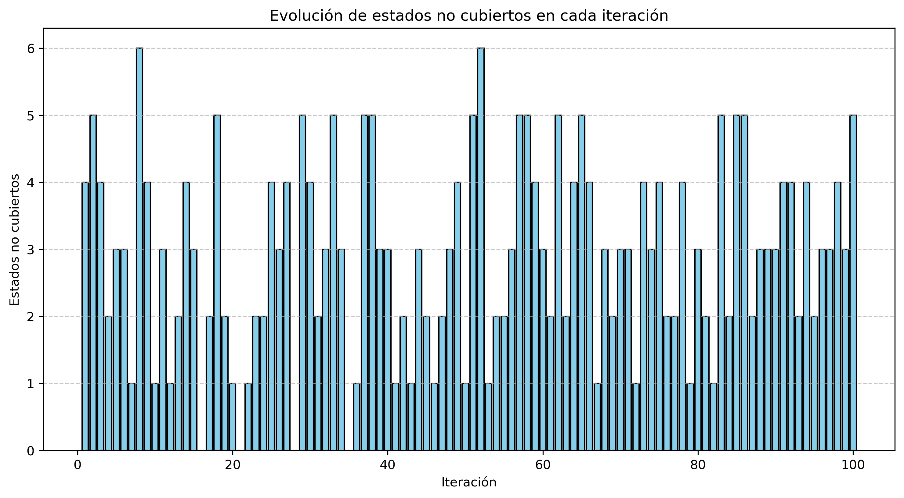

# Algoritmos de Optimización

Este repositorio contiene dos enfoques distintos para **seleccionar un conjunto óptimo de estaciones** que cubran la mayor cantidad de estados del oeste de EE.UU., que tendrá que utilizar **Beyoncé** para promocionar su disco:

1. **Algoritmo voraz (greedy)** → Selecciona siempre la mejor opción disponible.  
2. **Algoritmo ascension de colinas (hill climbing)** → Selecciona estaciones al azar, explorando diferentes posibilidades.

Ambos enfoques se comparan para evaluar su rendimiento y eficiencia. 

---

## Índice
1. [Instalación](#instalación)
2. [Uso](#uso)
   - [Algoritmo Voraz](#ejecutar-algoritmo-voraz)
   - [Algoritmo Ascensión de Colinas](#ejecutar-algoritmo-ascensión-de-colinas)
3. [Estaciones y Estados](#conjunto-de-estaciones-y-estados-del-algoritmo)
4. [Explicación de los Algoritmoos](#explicación-de-los-algoritmos)
   - [Qué hace el programa](#qué-hace-el-programa)
   - [Algoritmo Voraz](#algoritmo-voraz-greedy)
   - [Algoritmo Ascensión de Colinas](#algoritmo-ascensión-de-colinas-hill-climbing)

---

## Instalación
Para obtener este repositorio desde **GitHub**, usa el siguiente comando en la terminal:

```bash
git clone https://github.com/MiBasDev/Algoritmos-de-Optimizacion.git
```

Ahora, navega dentro de la carpeta del proyecto:

```bash
cd Algoritmos-de-Optimizacion
```

---

## Uso
### Ejecutar Algoritmo Voraz
Para lanzar el algoritmo voraz (greedy), ejecuta el siguiente comando:

```bash
python greedy_algorithm.py
```

### Ejecutar Algoritmo Ascensión de Colinas
Para lanzar el algoritmo de cscensión de colinas (hill climbing), ejecuta:

```bash
python hill_climbing_algorithm.py
```

---

## Explicación de los Algoritmos
### Qué hace el programa
Este programa **selecciona estaciones** de una lista predefinida para cubrir la mayor cantidad de estados posibles. Se utilizan dos enfoques:

1. **Enfoque Voraz (Greedy):** Siempre elige la estación que cubre más estados no cubiertos.
2. **Enfoque Ascensión de Colinas (Hill Climbing):** busca encontrar la mejor combinación de estaciones para cubrir el mayor número posible de estados.

---

### Conjunto de Estaciones y Estados del algoritmo

La siguiente tabla muestra qué **estados** cubre cada **estación**.

| Estación  | Estados Cubiertos          |
|-----------|----------------------------|
| kone      | ID, NV, UT                 |
| ktwo      | WA, ID, MT                 |
| kthree    | OR, NV, CA                 |
| kfour     | NV, UT                     |
| kfive     | CA, AZ                     |
| ksix      | NM, TX, OK                 |
| kseven    | OK, KS, CO                 |
| keight    | KS, CO, NE                 |
| knine     | NE, SD, WY                 |
| kten      | ND, IA                     |
| keleven   | MN, MO, AR                 |
| ktwelve   | LA                         |
| kthirteen | MO, AR                     |

---

### Algoritmo Voraz (Greedy)
**Lógica:**
1. Se inicializa un conjunto vacío de **estaciones seleccionadas**.
2. Se busca la estación que cubra la mayor cantidad de **estados no cubiertos**.
3. Se añade esa estación y se actualiza la lista de estados cubiertos.
4. Se repite hasta cubrir todos los estados.

```py
def max_station(remaining_stations, covered_states):
    """
    Encuentra la estación que cubre la mayor cantidad de estados no cubiertos.
    """
    best_station = None
    max_uncovered = -1
    
    for station in remaining_stations:
        uncovered = len(remaining_stations[station] - covered_states)
        if uncovered > max_uncovered:
            max_uncovered = uncovered
            best_station = station
    
    return best_station
```

**Resultados esperados del Algoritmo Voraz**

**Al ejecutar el código, se generará:**  

- Un archivo `doc/resultado_greedy.txt` con los detalles de cada iteración.  

---

### Algoritmo Ascensión de Colinas (Hill Climbing)
**Lógica:**
1. En cada iteración se **selecciona aleatoriamente un conjunto de 10 estaciones**.
2. Se evalúa cuántos estados pueden cubrir.
3. Si el nuevo conjunto cubre más estados que el mejor actual, se reemplaza.
4. El proceso se repite **100 veces** para mejorar la solución.
5. Se genera un gráfico con la evolución de los estados **no cubiertos en cada iteración**.

```py
def hill_climbing(iterations=100):
    """
    Algoritmo de búsqueda por ascensión de colinas:
    - Selecciona aleatoriamente 10 estaciones.
    - Evalúa cuántos estados cubren.
    - Reemplaza la combinación si encuentra una mejor.
    - Guarda el número de estados NO cubiertos en cada iteración.
    """
    stations = get_stations()
    station_keys = list(stations.keys())
    total_states = len(set().union(*stations.values()))  # Número total de estados únicos

    best_combination = random.sample(station_keys, 10)
    best_coverage = evaluate_combination(best_combination, stations)
    best_uncovered = total_states - best_coverage  # Estados no cubiertos
    iteration = 0

    uncovered_states_list = []  # Lista para la gráfica

    for i in range(iterations):
        new_combination = random.sample(station_keys, 10)
        new_coverage = evaluate_combination(new_combination, stations)
        new_uncovered = total_states - new_coverage

        uncovered_states_list.append(new_uncovered)  # Guardar para la gráfica

        # Si la nueva combinación es mejor, la guardamos
        if new_coverage > best_coverage:
            best_combination = new_combination
            best_coverage = new_coverage
            best_uncovered = new_uncovered
            iteration = i+1

    return best_combination, best_coverage, uncovered_states_list, iteration
```

**Resultados esperados del Algoritmo Ascensión de Colinas**

Al ejecutar el código, se generará:
- Un archivo `doc/resultado_hill_climbing.txt` con los detalles de cada iteración óptima.  
- Un gráfico de barras `doc/resultados_hill_climbing.png` con la evolución de los **estados no cubiertos** en cada iteración.  

Este es un **ejemplo de gráfica** que sacaría el algoritmo:


